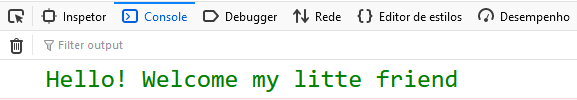

# JavaScript ES6

## Welcome 

```js
//----------------------------------------------------//
//       Author: Natan Cabral                         //
//  Description: No panic, this is simple javascript  //
//----------------------------------------------------//

// constant object
const welcome = {
  message: 'Welcome',
  person: 'my litte',
  subject: 'friend',
}

// arrow function destruction 
let GoodMorning = ({message: ms, person: ps, subject: su}) => {
  return ` ${ms} ${ps} ${su} `
}
// destruction array, you can change
let hi = [...['Hello!'], GoodMorning(welcome)]

// log
console.log("%c" + hi.map(e=>e).join(''), "color:green; font-size: 25px");

```
---



## Advanced

* [Arrow Funcion](basic/functions/arrow-function.md)
* [Map](while/map.md) | [Video](https://www.youtube.com/watch?v=80KX6aD9R7M&list=PLnHJACx3NwAfRUcuKaYhZ6T5NRIpzgNGJ)
* [Unique Values](basic/arrays/array-filter-unique-values.md)
* [Delete Array & Object](basic/advanced/delete-array-and-object.md)
* Dynamic Object Key [link](https://www.samanthaming.com/tidbits/37-dynamic-property-name-with-es6/)
* Filter and Finder 
* Reduce Basics
* [Destruction Array & Object](basic/advanced/destruction-array-and-object.md)
* Reduce Object Example 
* Getters and Setters [link](https://www.youtube.com/watch?v=bl98dm7vJt0)
* `${personal.name}`
* this | global or local [link](https://www.youtube.com/watch?v=gvicrj31JOM)

### Basic 

* Variable Naming Rules
* const, let, var
* Quotation Marks
* String Concatenation
* Numbers Basics
* Implicit Type Conversion
* Data Types
* [Arrays](basic/arrays/array-init.md)
  * [Concat](basic/arrays/array-concat.md)
  * [Some & Every](basic/arrays/array-some-and-every.md)
  * [Fill](basic/arrays/array-fill.md)
  * [Filter](basic/arrays/array-filter.md)
  * [Find](basic/arrays/array-find.md)
  * [Includes](basic/arrays/array-includes.md)
  * [Array.from()](basic/arrays/array-from.md)
  * Join [Link](https://developer.mozilla.org/en-US/docs/Web/JavaScript/Reference/Global_Objects/Array/join)
  * Map [Link](https://developer.mozilla.org/en-US/docs/Web/JavaScript/Reference/Global_Objects/Array/map)
  * Reduce [Link](https://developer.mozilla.org/en-US/docs/Web/JavaScript/Reference/Global_Objects/Array/reduce)
  * Pop Push Shoft Unshift [Link](https://developer.mozilla.org/en-US/docs/Web/JavaScript/Reference/Global_Objects/Array/pop)
  * [Delete](basic/advanced/delete-array-and-object.md)
  * Sort & Reverse [Link](https://developer.mozilla.org/en-US/docs/Web/JavaScript/Reference/Global_Objects/Array/reverse)
* Functions - Declare, Invoke
* Functions - Parameters, Arguments
* Functions - Return
* Objects
* Conditional Statements - Basics
* Conditional Statements Continued

### Equality

* Equality
* Logical Operators
* Switch Statement
* Null and Undefined
* Truthy and Falsy

### While

* while Loops
* do while loops
* for loop
* Array Iterators
* [forEach](while/forEach.md)
* Math Object
* Date Object

### DOM

* Get Element By ID
* Get Elements By Tag Name
* Get Element By Class Name
* Query Selector and Query Selector ALL
* Navigate the DOM - Children
* Navigate the DOM - parentElement
* getAttribute() setAttribute()
* classList and className
* createElement - createTextNode - appendChild
* insertBefore
* replaceChild
* prepend innerText
* remove removeChild
* innerHTML and textContent
* Change CSS with style property
* Click Event
* Function Reference
* Mouse Events
* Key Events
* Event Object

